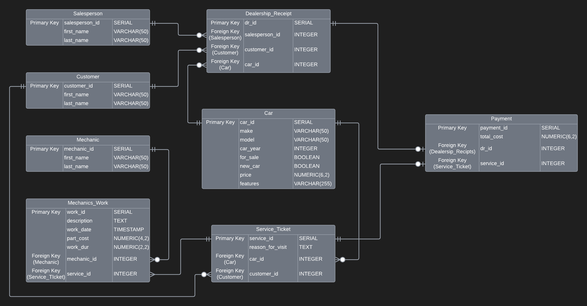

# Car Dealership Database
#### Using PosgreSQL and DBeaver:

This project was a weekend project for Coding Temple.  The goal of the project was to create an Entity Relationship Diagram and then the DDL and DML.  While creating tables I ran some one off insert commands and queries, but I also created some stored functions and procedures to make everyones life easier as this is a SQL only project.

## Project description:
In this repository there is one `.sql` file that contains both the DDL and DML.  The document has a visual divide that splits the DDL from the DML.  

The titles of all the functions are not the most intuitive, but down below you will see a [table](#functions) with a thorough description of each function.

## Installing, Running, and How to use:
This project was done using DBeaver 23.1.4 and a PostgreSQL database.  You should be able to just pull in my `car_dealership.sql` and run it from top to bottom without any issues.  I do not recommend hitting the 'run all' button in DBeaver, as you will be stuck sifting through dozens of windows trying to find the things you find interesting.  You might see some commented out blocks of code where I have some fragments of non-functional or less efficient code.

#### Functions {#functions}
Some aspects of my naming schemes might not seem completely intuitive without creating the front that I envisioned, but going back through to refactor it all is not really worth the time.  The `dealership_receipt` and `service_ticket` tables were meant to represent the same hub for keeping track of what needs to be paid, but the way I felt that they would be displayed down the line made sense to have these names.
| Stored Procedures | Description |
| -------- | ------- |
| `add_salesperson(first_name, last_name)` | Adds a person to the salesperson table.  For inputting new hires (Salespeople). |
| `add_mechanic(first_name, last_name)` | Adds a person to the mechanics table. For inputting new hires (Mechanic). |
| `add_customer(first_name, last_name)` | Adds a person to the customer table.  For inputting new customers whether they are purchasing a car or getting a service |
| `add_inventory(make, model, car_year, new_car, price, features) ` | Adds a car to the database for the purpose of it to be sold. |
| `add_customer_car(make, model, car_year, features) ` | Adds a car to the database so that it can be serviced.  It defaults the car price to 0, and sets the `for_sale` boolean to FALSE. |
| `create_service(reason_for_visit, car_id, customer_id) ` | Creates an entry in `service_ticket` to track mechanic work on a car being in the shop. |
| `create_work(description, part_cost, work_duration, mechanic_id, service_id) ` | Creates an entry in `mechanic_work` to track each job that is done to a car. This allows multiple different mechanics to work on different jobs on the same car based on availability.  It also timestamps the entries. |
| `create_dealership_receipt(salesperson_id, customer_id, car_id_to_sell) ` | Creates an entry in `dealership_receipt` to track the sale of a car to a customer and salesperson. When this is executed, I also switch the cars `for_sale` attribute from TRUE to FALSE. |
| `create_payment(desired_dr_id, desired_service_id) ` | Creates an entry in `payment` to track the final receipt costs getting charged to a bill.  Calls the below stored function `total_price`. |

| Stored Functions | Description |
| -------- | ------- |
| `total_price(desired_dr_id, desired_service_id)` | Takes a dealership receipt and a service ticket ID, and calculates the total cost of the two.  If only receipt exists, enter 0 for the oen you do not have.  The hourly work cost is $70/hr.  This is called internally in `create_payment`, and should probably be somehow denoted as an internal method. |
| `query_mechanics_work(desired_mechanics_id)` | Takes a mechanics ID number and returns all the work that they have done. |
| `query_car_work(desired_car_id)` | Takes a cars ID number and returns all the work that has been done to it. |
| `query_salesperson_total(des_salesperson_id)` | Takes a salespersons ID number and returns the number of sales and the total amount they have sold. |
| `show_all_cars(selector)` | Displays the dealerships inventory of cars for sale.  1 (default) is for all cars, 2 for new cars, and 3 for used cars. |

## Future Improvement:
- Add a procedure to buy a car and put car in for service.
    - Instead of submitting 2 commands to both buy the car and put in a service request, put them both into a command that calls each.  Default method to get the car detailed before the car gets picked up.  Also could be used if the buyer wants to get features added or tweaked after sale.

- Add more detail to all the 'source' tables.
    - I was more interested in getting the connections, functions, and procedures functional over adding rows like `phone_number`, `email`, and things of the sort, but those details are definitely important for a dealership.

